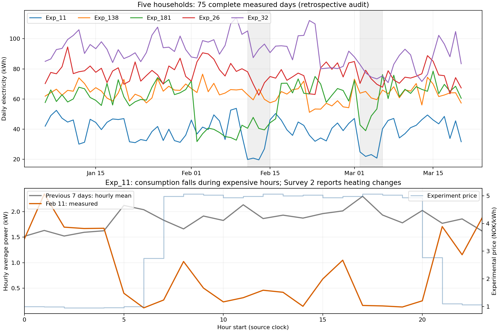

# iFlex 五户差异与源记录核验

五户的匹配条件只覆盖人数、设备类型/存在/数量/子类型向量、地区、日期和实验价格；**没有匹配供暖主辅角色、住房、成员构成、使用习惯或设备额定功率**。因此不能把这一组解释为完整配置相同的对照组。

本分析回读原发布问卷、参与者表和保留的 RData 小时导出，检查 2020-01-06 至 2020-03-20 的连续记录。事后问卷和目标日之后的数据仅用于原因复核。

## 光伏、共表与供暖口径

五户 Survey 1 的 `q17`（光伏）、`q18`（农场或经营共表）、`q16_bil_b`（电动车/插混）及 `q6b1`（出租单元）均为 No。`q3` 问的是是否购买保证可再生的电力，回答 Yes 不等于屋顶光伏。

五户均报告电暖器为主热源，独立电热水器供热水，木炉/壁炉为补充热源。电地暖在 Exp_138、Exp_181 家中是主热源，其余三户为补充热源。它们属于电供暖与木炉结合的配置，问卷没有量化当天木柴提供的热量。

| 家庭 | 住房与面积 | 木炉使用回答 | 夜间/无人时降温 | 前七天日均 kWh | 2 月 11 日 kWh | 相对历史 |
|---|---|---|---|---:|---:|---:|
| Exp_11 | 半独立住宅，120–159 m² | 最冷的日子 | 是 | 44.343 | 19.913 | −55.09% |
| Exp_138 | 半独立住宅，100–119 m² | 偶尔，主要为舒适氛围 | 是 | 65.834 | 62.870 | −4.50% |
| Exp_181 | 独立住宅，120–159 m² | 同时勾选“最冷日”和“冬季几乎每天” | 否 | 37.652 | 40.633 | +7.92% |
| Exp_26 | 独立住宅，120–159 m² | 最冷的日子 | 是 | 81.889 | 78.106 | −4.62% |
| Exp_32 | 独立住宅，≥160 m² | 冬季几乎每天 | 否 | 101.333 | 105.181 | +3.80% |

“木炉使用”是常态自报，多选回答保留原状。五户目标日的区域气温向量也相同，但没有逐屋室温、保温水平或设备运行数据。住房与供暖习惯的差异是真实记录，不能据此定量分配各因素造成的电量差。

## 5.28 倍怎样形成

Exp_32 与 Exp_11 在目标日前一周的日均电量已相差约 2.29 倍。目标日 Exp_32 比自身历史均值高 3.80%，Exp_11 则低 55.09%，两者共同形成约 5.28 倍的当日差距。该分解是描述性的，没有估计干预因果效应。



Exp_11 在 2 月 11–14 日分别用电 19.913、20.826、19.691、27.019 kWh，2 月 15 日回到 46.276 kWh；3 月 2–5 日另一段实验日期也出现连续下降。它在 Survey 2 的 `Aq18` 回答采取过措施，`Aq19_1/2/4/7` 分别记录关闭空房间电暖器、降低室温、以木炉替代电供暖和调整洗浴时间。这与实测降耗形状一致，但问卷回忆的是整个实验期，没有逐日动作时间戳，不能认定 2 月 11 日执行了全部措施或把 55.09% 当作因果节电率。

Exp_32 在前七天已平均每天用电 101.333 kWh，目标日的 105.181 kWh 对应全天平均 4.383 kW，属于持续的较高用电水平。较大住房和不在夜间/无人时降温是可能相关的已知条件，真实供暖负荷、热损失及设备功率仍未分解。

## 数据质量与处理

- 五户原问卷的全部 96 列与发布画像的源回答相等。
- 各户 75 天、1,800 小时，共 9,000 小时；时间连续，无重复、缺时、非有限值、负值或精确零值。小时最小/最大值及逐日电量见 [audit.json](audit.json)。
- 五户各 8 个发布窗口，共 40 个窗口的 192 个历史加目标读数，与保留的源导出逐点相等；问卷 ID、参与者地区与 H1 实验分组均核对。
- 未发现上述硬错误，保留这五户。电表校准、供电公司估算/插补记录及未申报设备没有独立证据，尚不能排除来源层问题。
- Exp_181 在 2 月上半月也出现持续水平变化，且没有 Survey 2 回答；保留待复核标记。Exp_11 的明显降耗保留为活动期行为复核案例。两者均不因偏离历史而直接删除。

对这类数据，确定的时间、重复、单位、非有限值和身份联接错误应隔离；持续高用电与实验期降耗需结合问卷和邻日检查。仅按跨户高低或偏离历史的幅度删除，会同时移除可能真实的响应行为。没有改动冻结数据或家庭划分。

## 复现

```bash
python3 scripts/audit_iflex_five_households.py \
  --source-dir /path/to/publisher_csvs \
  --hourly-export /path/to/iflex_all432_phase1_raw.csv.gz \
  --plot
```

需要原发布 `survey1_answers.csv`、`survey1_questions.csv`、`survey2_answers.csv`、`participants.csv`，以及已有的 RData 小时导出。导出字段与文件 SHA256 保存在 [audit.json](audit.json)；本次没有重新解码完整 RData。绘图依赖 matplotlib，其余核验使用标准库。

原始来源：[iFlex Zenodo v2](https://zenodo.org/records/8248802)、[数据论文](https://doi.org/10.1016/j.dib.2023.109571)。Survey 2 只用于事后复核，不加入预测输入。
