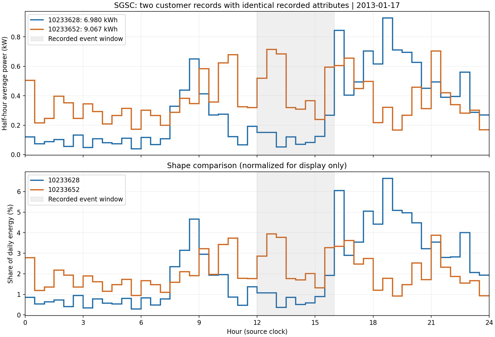
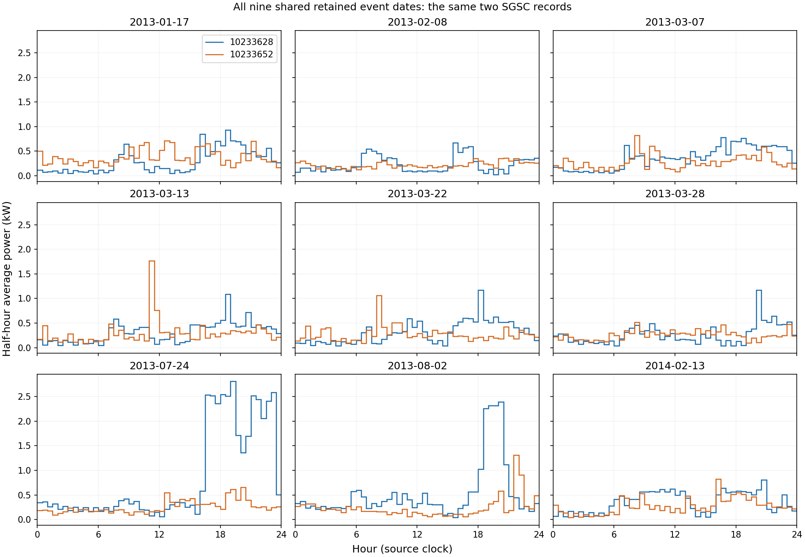

# SGSC：源记录一致的两户负荷比较

客户 10233628 与 10233652 的原始家庭表共 46 列，除 `CUSTOMER_KEY` 外，其余 45 列逐项相同，包括空值、来源分类和管理日期。两条记录位于原 CSV 的第 21,530、21,800 条记录（含表头），已按客户号、整行内容和源文件哈希回查。完整发布画像也相等。

## 一致的具体资料

| 项目 | 两户共同记录 |
|---|---|
| 房型、气候区 | 公寓／Unit；Mild temperate |
| 空调、冰箱 | 有分体空调；1 台冰箱 |
| 光伏、自备发电 | 净光伏表、总光伏表数量均为 0；HAS_GENERATION=N |
| 供电口径 | 1 个普通供电表；受控负荷和其他表数量为 0 |
| 燃气 | 有燃气、用于烹饪；燃气供暖、热水及其他燃气设备均为否 |
| 其他设备和习惯 | 无泳池泵；烘干机使用为 NONE；记录供暖房间数为 0；白天不在家 |
| 试验条件 | Network，NETDPRPPE；同活动日期、活动 ID、时段、类型及证据类别 |
| 主图日期 | 2013-01-17；12:00–16:00 reduction_reward 活动 |

这 45 列不等于 45 个独立、完整的家庭特征。人数、面积、精确地址、设备额定功率和操作状态未记录，空值相等也不能证明真实值相等。相同产品代码不构成数值费率相同的证据。图的准确含义是“源数据中已记录资料一致的两条家庭客户记录”，不能据此声称两个真实家庭所有条件完全一致。

## 最早共同活动日



| 客户号 | 前七天日均 kWh | 2013-01-17 实测 kWh |
|---|---:|---:|
| 10233628 | 6.564 | 6.980 |
| 10233652 | 6.210 | 9.067 |

上图保留原生半小时曲线，区间 kWh 除以 0.5 小时得到平均 kW。下图将各半小时电量除以本户当天总量，展示电量在一天内的分配；归一化只用于展示，未修改 benchmark 输入和答案。灰色区域为记录的活动时段，未估计因果节电量。

## 全部共同日期



主图按最早共同日期选取。附图包含筛选后两户全部 9 个共同活动日，避免只展示差异最大的日期。两户的 9 个窗口都属于训练分区。

## 选择与核验

在训练分区中，先要求住房、冰箱、供暖房间数、燃气用途、空调、泳池泵、在家情况和自备发电等指定字段非空，并排除有光伏/发电或仅有画像推测活动条件的记录。按完整发布画像、原始表 38 个非编号/非日期字段、完整目标日条件与活动证据类别分组，得到 4,119 个合格窗口、47 个至少含两户的日期组，最大组为两户。按组大小、日期和客户 ID 排序选取；没有按目标负荷差距排序。选出的这两户再核对日期，最终仅客户编号不同。

分组包括来源推断分类和管理状态，其取得时间不完整，因此这是一项描述性匹配分析。这些字段未新增为模型输入，也未用于确定训练/验证/测试划分。

对两户的 18 个八天窗口逐点回查原始表，共 6,912 次读数比较，覆盖 6,528 个不同的“客户－半小时”。全部普通供电读数与发布历史及答案完全相等；所需时段无缺失、重复、非有限值或负值，受控负荷、净/总发电及其他通道全为零。原始表计文件哈希相符。不同客户号和不同曲线支持记录层面的区分，精确住址不可得，未独立认证物理住户身份。

[comparison.json](comparison.json) 保存原始两行、共有画像、所有共同日的历史和答案、选择规则、差异列及哈希核验结果。

```bash
python3 scripts/compare_sgsc_matching_households.py \
  --household-csv /path/to/sgsc-ct-customer-household-data-revised.csv \
  --pipeline-root /path/to/load_response_pipeline \
  --plot
```

脚本读取已发布 benchmark 和来源 CSV，不改写原有数据或划分。绘图依赖 numpy、matplotlib，其余部分使用标准库。
