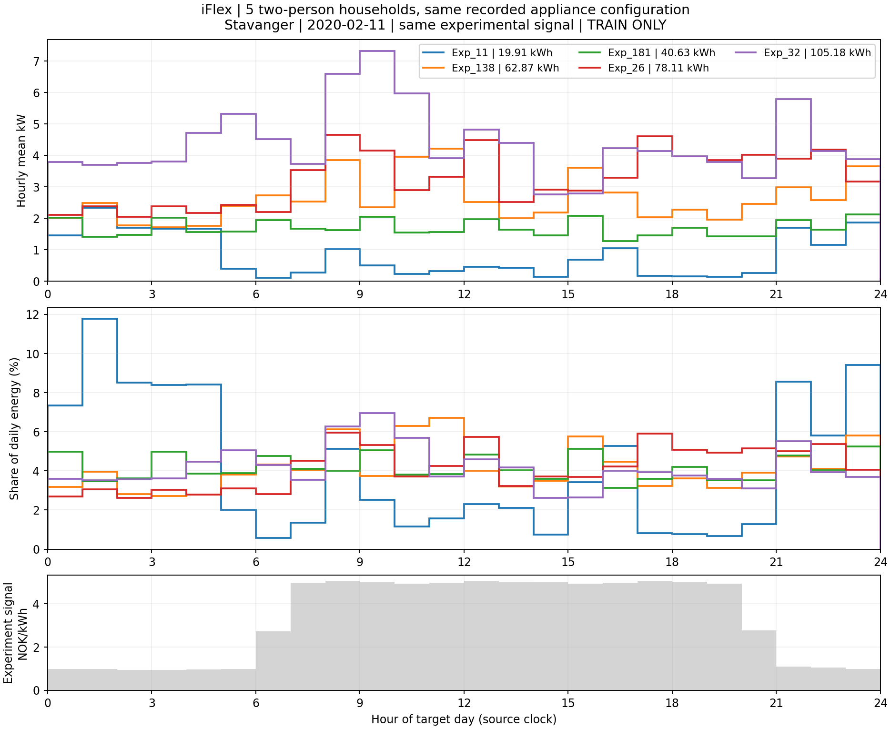
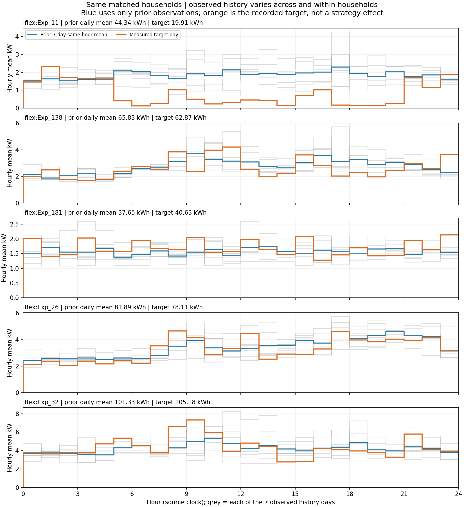
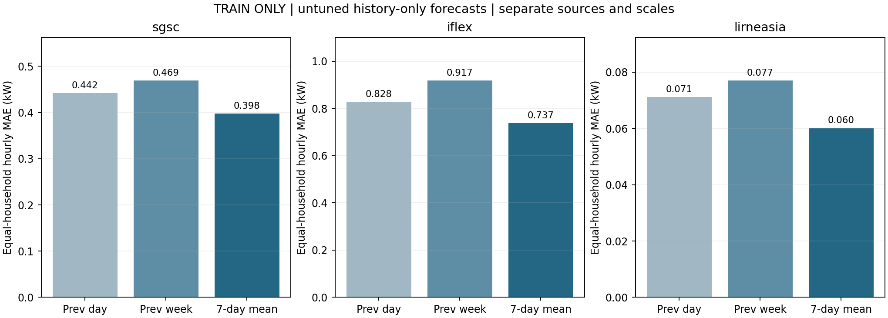

# 训练分区的家庭曲线与历史基线

本分析使用已发布数据的训练分区，比较相似家庭的实测曲线，以及三种直接使用历史的预测方法。没有训练模型，未使用验证或测试分区。

## 匹配家庭

在 iFlex 训练分区中，按家庭人数、完整设备类型/存在/数量/子类型向量、地区、目标日及 24 小时价格向量分组，选家庭最多的一组；并列时按输入键排序。选择不使用目标电量。

选中 2020-02-11 的 Stavanger 五户两人家庭。其设备记录向量相同，已知供暖/热水设备包括电暖器、电地暖、独立电热水器和木炉/壁炉；木炉不是电器。相同设备向量不保证额定功率和运行方式相同，也没有匹配供暖主辅角色、住房及生活习惯。五户原问卷均无光伏、无电动车、无经营共表；进一步的 [75 天源记录与事后行为核验](../iflex_five_households/README.md) 发现 Exp_11 在实验期持续降耗，并自报过降温和改用木炉。五户不能视为完整配置相同的对照组。

| 家庭 | 面积 m² | 白天在家 | 舒适温度 °C | 历史七天日均 kWh | 目标日 kWh |
|---|---|---|---:|---:|---:|
| Exp_11 | 120–159 | 否 | 23 | 44.343 | 19.913 |
| Exp_138 | 100–119 | 是 | 22 | 65.834 | 62.870 |
| Exp_181 | 120–159 | 是 | 21 | 37.652 | 40.633 |
| Exp_26 | 120–159 | 是 | 22 | 81.889 | 78.106 |
| Exp_32 | ≥160 | 否 | 23 | 101.333 | 105.181 |



最大与最小目标日电量相差 5.282 倍。图中日内占比用目标日总量归一化，仅用于展示形状。



灰线为此前七个实际日，蓝线为同小时历史均值，橙线为目标日。Exp_11 的目标日明显低于自身历史，这一差异没有单独归因于某个家庭特征或价格。

## 历史与目标日电量


每点对应一个家庭，横纵坐标分别为该户训练样本的历史七天日均电量、目标日电量的平均值。SGSC、iFlex、LIRNEasia 的 Pearson r 分别为 0.9472、0.9870、0.9869。这是家庭长期用电规模的描述统计；窗口重叠和户内平均会增强稳定性，相关系数不作为预测准确率。

## 历史基线

三种方法分别复制前一天、复制前一周同日、取此前七天同小时均值。按正式评分函数先算每日小时功率 MAE，再在户内平均、最后等权平均家庭。

| 训练集 | 家庭 / 家庭日 | 前一天 MAE kW | 前一周 MAE kW | 七天同小时均值 MAE kW |
|---|---|---:|---:|---:|
| SGSC | 1,453 / 11,432 | 0.4424 | 0.4689 | 0.3976 |
| iFlex | 219 / 1,449 | 0.8277 | 0.9171 | 0.7373 |
| LIRNEasia | 287 / 4,309 | 0.0711 | 0.0770 | 0.0602 |



七天均值相对前一天的 MAE 降低 10.13%、10.93%、15.29%。这些结果是训练分区诊断，不涉及画像输入的增益或策略执行效果。

## 复现与数据

```bash
python3 scripts/analyze_training_curves.py
```

依赖 numpy、matplotlib。脚本：[analyze_training_curves.py](../../scripts/analyze_training_curves.py)。[training_curve_evidence.json](training_curve_evidence.json) 保存输入与划分哈希、分组规则、五户画像和曲线、散点及指标；[verification.json](verification.json) 保存独立复算的核验结果。
