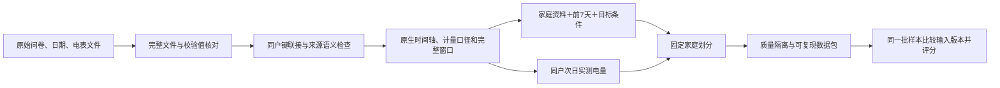

# 家庭负荷 benchmark：构造参考、数据合同与复现细节

更新：2026-09-09。本文对应已发布文件和执行代码，用于汇报与复现。

简短口头汇报可先看 [阶段汇报提纲](REPORT_BRIEF_20260909.md)，逐项核对见 [自审记录](REPORT_SELF_AUDIT_20260909.md)。核心研究问题是：**给定同户过去七天用电，家庭画像与目标条件是否提供额外预测信息？** 当前完成数据与协议，效果结论留待实验。

## 1. 当前研究任务与实际进度

目标是预测**同一真实家庭未来一天的区间电量**。家庭资料说明“这一户是谁、有哪些设备及使用特征”，七天历史提供自身用电水平和节律，活动或日历条件描述要预测的那一天，答案来自同户电表。

已完成数据整理、可复现构造、固定家庭划分与评分接口；尚未进行模型训练、SFT 优势比较或调控方案因果验证。“家庭模拟器”是后续模型用途，不表示这里的监督答案由模型仿真产生。

| 来源与版本 | 默认可评测家庭 | 默认家庭日 | 原生历史 → 答案 | 条件与定位 |
|---|---:|---:|---|---|
| SGSC，冻结 benchmark v1 | 2,076 | 16,246 | 336 → 48 个半小时值 | 已记录活动类型与时段；数值费率未知 |
| iFlex，冻结 benchmark v1 | 314 | 2,071 | 168 → 24 个小时值 | 实验价格；可选此前七天气温 |
| LIRNEasia，独立扩展 v1 | 410 | 6,325 | 672 → 96 个 15 分钟值 | 问卷先于历史的日常次日购电预测 |

仓库默认保留资源合计 **2,800 户、24,642 个家庭日**。这是跨来源的数据资源盘点，不能当作 24,642 个独立家庭，也不是把不同任务混成一个排行榜。SGSC/iFlex v1 的数据、划分和既有评测规则保持冻结。

LIRNEasia 完整核验阶段是 **422 户、6,660 个窗口**；发布阶段按仓库既有零读数规则隔离 335 条，得到表中 410 户、6,325 条。被隔离原记录、422 户画像和源累计读数均保留。

## 2. 构造参考：借鉴了什么，哪些是自己的选择

| 来源 | 当前可核查的依据 | 本项目借鉴 | 不应推出的结论 |
|---|---|---|---|
| [Guo、Lam、Li，Applied Energy 2019](https://hub.hku.hk/handle/10722/275013)，DOI 10.1016/j.apenergy.2018.11.014 | 作者机构的完整摘要；未据此声称读到付费全文 | 将家庭/住宅、设备持有和同户历史作为条件输入；其研究使用爱尔兰实地 TOU 数据 | 不证明这些特征在我们的三份数据一定有效，也不给我们具体 7+1 窗口规则 |
| [PromptCast，IEEE TKDE，作者全文 v5](https://arxiv.org/html/2210.08964v5)，DOI 10.1109/TKDE.2023.3342137 | III-A、III-B 与 Table I | 从真实序列切出历史/未来配对，再用固定模板表达输入和观测答案；数值模型和语言模型比较同一批观测 | 原文默认日尺度 15 步→1 步、时间顺序 7:1:2 划分；我们没有照搬这些长度或划分 |
| [ChatTime，AAAI 2025，作者全文](https://arxiv.org/html/2412.11376v1) | 3.2、3.4、Appendix A.2/B.2 | 对齐文本条件和历史序列；训练输入避免未来实测信息；任何归一化不得使用目标值 | 原方法包含时序持续预训练、数值词表和 LoRA；不是我们已经完成的训练，也不证明普通 JSON SFT 等价 |
| [LIRNEasia 作者仓库与文档](https://github.com/LIRNEasia/SL_electricity_consumption) | 同户键、W1 各表、survey_dates、累计 import/export 字段及原始文件；本地全量复核见扩展 provenance | 同户联接、问卷日期约束、相邻累计读数差分 | 累计 kWh 不能直接当瞬时 kW；约 4,000 调查户不是最终可用高频户数 |
| [既有 SGSC/iFlex 构造协议](../benchmark/v1/evaluation/protocol.json)及[输入证据](../benchmark/v1/provenance/input_evidence.json) | 冻结协议、原始记录及当前核验脚本 | 固定家庭划分、连续零读数隔离、小时统一计量、等权家庭评分 | 协议通知时间不等于逐户实际送达；现有负荷不是同意标签或因果反事实 |

**本项目自行确定的规则**：7 个完整历史日→1 个完整目标日、按原生分辨率保留答案、按家庭划分、至少 24 小时精确零读数隔离、先家庭后来源的评分聚合。它们为调度所需的一天周期、周内节律和未见家庭比较服务，是明确的操作性设计，不称为文献证明的最优选择。7+1 的效用仍需后续在同一预算下比较不同历史长度。

## 3. 从原始文件到样本

本节共同原则适用于三份来源；W1 日期筛选、累计表底差分及 769 端点规则专门适用于 LIRNEasia。SGSC/iFlex 的具体构建使用已核验的原生区间电量，见各自冻结协议。

### 3.1 来源内联接，不跨库拼家庭

三份数据分别以各自原生户号联接，不将 RECS 等调查画像匹配到另一来源曲线上。SGSC 单表用普通供电通道，双表在相同时段合计普通供电与受控负荷；iFlex 沿用源家庭需求字段。LIRNEasia 的 target 明确为**电网购电量**，不能把光伏户的购电或购电减上网称为全部终端用电。

新增来源采用 W1 家庭表、成员表、普通家电、AC、风扇、照明、发电及日期表。严格筛选排除多电表、家庭经营、共享租客/寄宿情形；核实有效人口/面积、房型、社会经济类别、成员数量、至少两类普通设备；W1 声明无自发电、备用发电与储能，窗口内出口增量为零。筛选代码见 [full_cohort_audit.sql](../extensions/lirneasia_history_v1/provenance/full_cohort_audit.sql)。

### 3.2 问卷与预测时间

LIRNEasia 每个窗口要求 `W1 survey_date < history_start_date`，保守排除同日问卷。没有将事后 W2/W3 回填进此前预测；画像是已知历史快照，不宣称设备之后未变。原生 `date + time` 用于连续性，未猜测数值 timestamp 的细粒度含义或 UTC 偏移，未证明电表记录可实时取得。

SGSC/iFlex v1 保持回顾性条件预测口径；逐户问卷及通知到达时间未完全核实，不改称严格在线预测。iFlex 可选 168 个历史地区气象站温度，截止于预测起点；Survey 2 只进入 review，不作为模型输入。

### 3.3 LIRNEasia 的累计电表如何变成负荷答案

对 LIRNEasia 相邻时刻，区间电量定义为 `e[t,t+15m) = C_import(t+15m) - C_import(t)`，单位 kWh。端点唯一、有限、相距恰好 900 秒且差分非负才可用；重置、缺口、重复点都不会被静默修补。每个完整日从 00:00 到 24:00 有 96 个区间。

一个 8 天窗口需要 **769 个累计端点 → 768 个区间电量**；前 672 点为历史，后 96 点为答案。模型输出就是未来真实区间电量，未经过教师 LLM、物理模型或行为仿真生成。使用 kW 时才除以 0.25 小时。

### 3.4 窗口与滑动规则

历史 `[D−7天 00:00, D 00:00)`，答案 `[D 00:00, D+1天 00:00)`，步长 1 天。一个连续 L 天片段给出 `L−7` 条窗口。新数据 1,043 段、每段 8—37 天，总计 6,660 条；它们存在重叠，不能当作独立同分布样本。

### 3.5 质量筛选不是标签修正

旧 v1 隔离 84 条 SGSC 连续至少 24 小时零读数窗口；本轮同样规则在 LIRNEasia 检出 335 条、涉及 43 户，其中 12 户没有任何保留窗口。零值仍保留原样，不自动判定无人、故障或缺失，也不插值。默认读取和评分排除隔离集。

完整性、出口和零值检查涉及目标日，因此结论只适用于筛选后的样本，不是部署前可执行的筛选，更不是人口总体平均表现。

### 3.6 实际日期覆盖与画像时效

重新逐行统计公开保留文件：SGSC 有 21 个目标日期（2013-01-17—2014-02-13），iFlex 有 11 个（2020-02-11—03-09），LIRNEasia 有 91 个（2024-04-05—07-30）。这里是各来源日期的并集，不表示每户都有所有日期或期间每天都有数据。LIRNEasia 每户保留窗口数为 1—49，中位数 13。

LIRNEasia W1 问卷距目标日为 8—227 天，按 6,325 条保留样本计算中位数为 124 天。问卷中的“上周使用时长／在家时长”是**调查前一周的回忆**，不是历史电表窗口对应的那七天。当前文件保留这个历史快照；后续模型模板需要明确调查时点语义，不能把它转述成目标周的行为事实。可在未来实验中比较不同快照年龄或移除回忆行为字段，当前未做该效果分析。

这些统计由实际发布文件重算，见 [自审统计](REPORT_SELF_AUDIT_STATISTICS_20260909.json)。

## 4. 字段合同与一个真实例子

`input` 仅包含画像、历史和当时可用/明确记录的条件；`output` 是实测目标；`metadata` 保存原户号、日期证据、分区及质量追溯，不传给模型。

| 内容 | SGSC/iFlex v1 | LIRNEasia 扩展 |
|---|---|---|
| 画像 | 统一家庭/设备 schema，未知为 null | 原生 W1 household、demographics、appliances、AC/fan/light、generation 模块 |
| 历史值 | 336 / 168 个 kWh | 672 个 15 分钟 kWh |
| 条件 | 已记录活动；iFlex 实验价格 | 原生日历；未添加未经核实的电价或活动 |
| 答案 | 48 / 24 个原生 kWh | 96 个 15 分钟购电 kWh |
| 原始身份键 | 仅追溯 | 源表与 metadata 中保留，语义输入删除 |

“全够”是指该任务所需信息在同户可联接，不表示问卷每个条件跳题都有值或每台设备都有功率轨迹。月支出不写成收入、无使用不写成无持有、未知数量不补成 1。新来源原生画像尚未被强行归一成已有 schema；按各自读取接口使用。

[真实样例 ID0053](../extensions/lirneasia_history_v1/examples/lirneasia.json)：问卷 2023-12-11；历史 2024-04-20 至 04-26；预测 04-27。5 人家庭，有成员与设备原资料。目标前四个区间约为 0.011、0.010、0.011、0.0101 kWh，全天 1.727 kWh；文件保留原差分精度。这是观测样例，不是模型预测性能示范。

## 5. 固定划分、泄漏约束与比较

SGSC/iFlex 原划分不变。新来源先按固定盐与户号的 SHA256 排序，将 422 户分为 295/63/64 户，隔离后不重分配。默认有样本的家庭为 287/62/61 户，对应 **train 4,309、validation 911、test 1,105** 条。

同户所有滑动窗口位于同一分区，目标日期可在不同家庭间重叠。因此当前评估“未见家庭”，不声称未见时间或跨国迁移。归一化、词表、统计预处理仅在 train 拟合；validation 选参数；test 前固定模型、输入版本、预算与随机种子。

新来源提供 `history_only` 和 `history_profile`，二者都保留目标日历与计量范围，用相同样本比较增加画像的效果。旧 v1 继续使用原五个输入版本，iFlex 历史气温单独消融。不用不同样本量的两组成绩证明画像贡献。

## 6. 评分与解释

主指标为小时平均功率 MAE。SGSC 两个半小时电量相加、LIRNEasia 四个 15 分钟电量相加，iFlex 已为小时；每小时 kWh/1h 得平均 kW。每户先平均各日指标，再等权平均家庭，避免记录多的户主导评分。

辅助指标包括逐日小时 RMSE、全天总电量绝对误差与小时峰值误差；LIRNEasia 另报告原生 15 分钟功率 MAE，以免小时平均掩盖短峰值。活动误差仅用于已有事件标签的旧 v1，新来源不制造事件区间。各来源单列成绩；主版本原有两来源等权汇总不变，不自动扩为三来源同榜。

评分器要求完整的所选测试/验证样本 ID 和原生长度。少报难样本、多报/重复 ID、非法数值或单位长度错误均失败。恒等答案和统一增加 1 kW 仅用于核对评分公式，不是训练结果或基线排名。

## 7. 已发布与复现路径

- 旧主版本：[benchmark/v1](../benchmark/v1/README.md)，18,317 条；[iFlex 气温扩展](../extensions/iflex_context_v1/README.md)。
- 新数据：[LIRNEasia 扩展](../extensions/lirneasia_history_v1/README.md)，6,325 条默认样本与 335 条隔离原记录。
- 默认构建：[build_lirneasia_extension.py](../scripts/build_lirneasia_extension.py)，只需标准库和公开源摘录即可重建选定窗口。
- 全原文件复核：[audit_lirneasia_raw.py](../scripts/audit_lirneasia_raw.py)，需要 9 个原 CSV 和 DuckDB CLI；先验证源哈希再执行全量准入 SQL。
- 验证：[verify_lirneasia_extension.py](../scripts/verify_lirneasia_extension.py) 逐窗比对源累计读数、画像时间及划分；[结果](../extensions/lirneasia_history_v1/verification.json)。
- 读取/评分：[lirneasia_io.py](../scripts/lirneasia_io.py)；[固定协议](../extensions/lirneasia_history_v1/evaluation/protocol.json)。
- 许可与原作者署名：[DATA_LICENSES.md](../DATA_LICENSES.md)。

### 后续最小比较方案（尚未执行）

先比较复制前一天、复制前一周同日和七天同槽均值等只依赖允许历史的朴素预测；再用同一模型和预算比较加入画像前后，SGSC/iFlex 另比较事件／价格条件。模型选择仅用 validation，冻结后再评 test；画像新旧程度、去掉回忆行为字段和历史长度的影响作为后续分析。当前没有这些方法的实测分数。

## 8. 汇报可以说到哪里

已具备三份真实数据、同户画像与负荷配对、可复现样本、固定划分和评分工具；新增数据还提供逐户问卷早于窗口的日期证据。尚未训练、尚未证明画像/SFT 提升；真实整户日负荷也不是新调控方案下的因果响应、逐设备执行或住户同意标签。后续先用相同划分比较历史基线与增加画像的模型，再讨论用于调度系统的边界。
