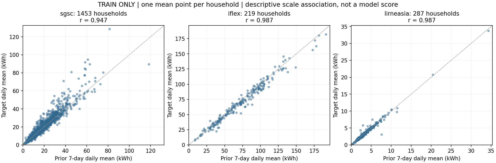

# 用真实曲线检验研究路线的依据

日期：2026-09-09。本轮按用户要求，补充“家庭信息与历史能否支撑负荷预测、进而支撑策略研究”的实物证据。全部统计与选图只使用既有 **train 分区**；没有拟合模型、调整参数或用 validation/test 选例子。下述是探索结果，当前还不能据此认定画像或 SFT 优于其他方法。

## 1. 同人数、同已记录设备配置，负荷是否相同

从 iFlex train 中按以下输入分组：家庭人数、完整发布设备向量的 type/present/count/subtype、地区、目标日、24 点实验价格。取家庭数最多的组，同规模时按输入键字典序取第一组；**没有按目标差异挑最大反差的家庭或日期**。

结果是 Stavanger 的 **5 户两人家庭，2020-02-11，同一实验价格信号**。记录为肯定存在的设备/供暖设施均是电暖板、电地暖、独立电热水器和壁炉/木炉；其余已发布设备字段的否定/未知状态也一致。这里的“相同”限于已记录字段，不证明设备功率、所有未调查设备或真实操作相同，木炉本身也不是电器。

图上部是每小时实测电量对应的平均 kW；中部除以各户当天总量后显示各小时占比，只用于事后形状展示，**这种目标日归一化没有进入任何预测输入**；底部为五户相同的实验信号。

| 家庭 | 过去七天日均 kWh | 目标日实测 kWh | 面积 m² | 白天有人在家 | 舒适温度回答 |
|---|---:|---:|---|---|---:|
| Exp_11 | 44.343 | 19.913 | 120—159 | 否 | 23°C |
| Exp_138 | 65.834 | 62.870 | 100—119 | 是 | 22°C |
| Exp_181 | 37.652 | 40.633 | 120—159 | 是 | 21°C |
| Exp_26 | 81.889 | 78.106 | 120—159 | 是 | 22°C |
| Exp_32 | 101.333 | 105.181 | ≥160 | 否 | 23°C |

最大与最小日总量相差 **5.282 倍**，消除日总量尺度后也仍有形状差异。因此，“两个人＋几类设备”不能唯一确定一条家庭曲线。完整住房、习惯、设备状态和自身历史值得进入研究；这些差异目前并未被因果归因到面积、温度或某台设备。

## 2. 同户历史提供了什么

每个小图显示同一户此前七天的逐小时实测曲线（灰）、七天同时段均值（蓝）和目标日实测（橙）。不同家庭的长期用电量级在历史中已经有明显区别；部分目标曲线也保持相近节律。但 Exp_11 的目标明显低于此前历史，说明历史并不完整解释当天变化。

不能把 Exp_11 的差值直接写成奖励造成的削减，也不能说某台设备实际关停；没有该日动作和反事实证据。它提示需要研究条件、状态与行为差异，而不是证明其中某个解释已经成立。

## 3. 不只展示五户：所有训练家庭的历史—目标关系

每个点是一户：先对该户每个样本的“七日历史日均”和“目标日总量”分别统计，再在户内平均。这样每户只有一个点，不把重叠家庭日当作独立受试者。

| 来源 | 使用训练家庭／家庭日 | 户均历史量与户均目标量的 Pearson r |
|---|---|---:|
| SGSC | 1,453 户／11,432 条 | 0.947 |
| iFlex | 219 户／1,449 条 | 0.987 |
| LIRNEasia | 287 户／4,309 条 | 0.987 |

这支持“自身历史包含稳定的用电量级信息”，是采用家庭历史的实证依据。**这不是 94.7%/98.7% 的预测准确率，也不是逐时形状或家庭日变化均可预测的证据。** 相邻窗口有重叠，户内平均与长期量级差异会增强这种相关；不把它作为独立测试集的模型成绩。

## 4. 训练分区上的无需训练预测检查

三种方法都只读取当前样本允许的七天历史：复制前一天、复制前一周同日、七天同一时段平均。没有调参、拟合或使用目标值计算预测。按已有指标先算每天小时 MAE，再户内平均、最后各户等权，来源分别报告。

| 来源 | 复制前一天 MAE kW | 复制前一周同日 | 七天同时段均值 |
|---|---:|---:|---:|
| SGSC | 0.4424 | 0.4689 | 0.3976 |
| iFlex | 0.8277 | 0.9171 | 0.7373 |
| LIRNEasia | 0.07111 | 0.07698 | 0.06024 |

三来源中，七天同时段均值都低于复制前一天的误差。不同来源用电规模与筛选不同，不跨来源比较 MAE 大小来判断数据质量。这里没有估计泛化置信区间或报告测试集结论；已有工程测试通过与本次朴素预测结果也分别记录。

这是当前材料中第一组明确的**训练分区探索性预测数字**。因此，之前“没有任何预测分数”的表述应更新；准确表述为“已有无需训练的历史预测诊断，尚无学习模型、画像增益、SFT 或策略效果的正式比较”。

## 5. 对研究主线究竟支持到哪里

| 主张 | 目前依据 | 尚需做什么 |
|---|---|---|
| 用同户真实记录建立负荷预测任务具有可操作性 | 有同户画像/历史/条件/真实答案；曲线可直接复算并评分 | 按冻结划分开展正式模型比较 |
| 人数和已知设备类型不能唯一确定负荷 | 同组五户在同地区、同日、同信号下仍有量级和形状差异 | 更丰富画像与状态的增量价值要做消融 |
| 自身历史值得作为核心输入 | 全训练家庭的量级关联、历史曲线及朴素预测结果 | 检验相对常数/群体参考与模型的泛化收益、逐时形状和变化预测 |
| 完整画像与当天条件值得研究 | 匹配组仍有住宅、习惯差异；部分目标偏离过去历史 | 相同样本、模型和预算下比较有无画像、条件；不能从图直接宣布有增益 |
| 策略应依家庭条件产生并评估负荷 | 家庭间负荷和服务条件不同，统一方案缺少个体依据 | 实现动作/约束合同，补必要设备状态，区分预计效果与真实执行效果 |

适合汇报的表述是：**真实数据表明，设备与人数的粗分类无法充分描述家庭负荷，而自身历史包含明显的可预测信息。因此，联合家庭画像、历史和条件进行负荷预测，并据家庭约束研究策略生成，是有数据依据、可以检验的研究路线。具体模型是否更优、画像是否带来增益，以及策略是否有效，仍由后续对照回答。**

## 复算与核验

- [分析脚本](../scripts/analyze_training_curve_evidence.py)：固定选组规则、仅 train、原生电量聚合到小时、图表和指标。
- [数据与完整数值](curve_evidence/training_curve_evidence.json)：包括来源/划分 SHA256、五户原画像和完整八日小时曲线、各户散点坐标及统计。
- [独立评分核验](curve_evidence/verification.json)：另用标准库在原生分辨率生成预测，调用原有 SGSC/iFlex 与 LIRNEasia 评分函数，复核三来源全部 train 样本，指标在 1e-12 相对容差内一致；五户曲线和画像与发布样本逐值一致。

冻结数据、家庭划分和评分函数均未修改。没有产生住户策略金标，没有执行设备控制，没有启动 SFT/Teacher。
