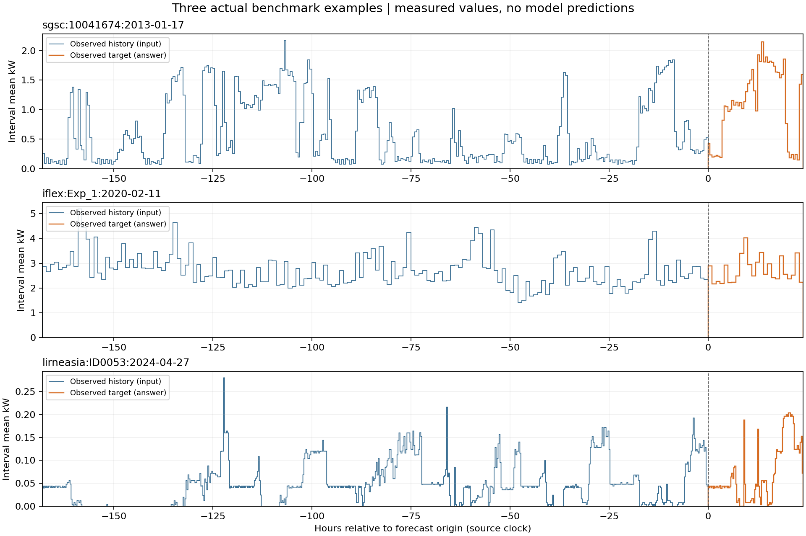

# 实测样本

下图直接读取发布包中的完整样本，左侧为七天历史，右侧为目标日实测电量。



| 来源与家庭 | 目标日 | 历史 / 答案点数 | 目标日电量 | 完整记录 |
|---|---|---|---:|---|
| SGSC 10041674 | 2013-01-17 | 336 / 48 | 26.293 kWh | [JSON](../../benchmark/v1/examples/sgsc.json) |
| iFlex Exp_1 | 2020-02-11 | 168 / 24 | 65.314 kWh | [JSON](../../benchmark/v1/examples/iflex.json) |
| LIRNEasia ID0053 | 2024-04-27 | 672 / 96 | 1.727 kWh | [JSON](../../extensions/lirneasia_history_v1/examples/lirneasia.json) |

[verified_examples.json](verified_examples.json) 包含源文件 SHA256、完整画像、目标条件、电量摘要和累计读数检查。LIRNEasia 目标日起始累计读数为 2557.408、2557.419、2557.429、2557.440、2557.4501 kWh，相邻作差约为 0.011、0.010、0.011、0.0101 kWh；完整 768 个差分与历史加答案逐点相等。

从仓库根目录运行：

```bash
python3 scripts/build_data_examples.py
python3 scripts/build_data_examples.py --plot
```

JSON 提取只依赖 Python 标准库，绘图额外依赖 matplotlib。
